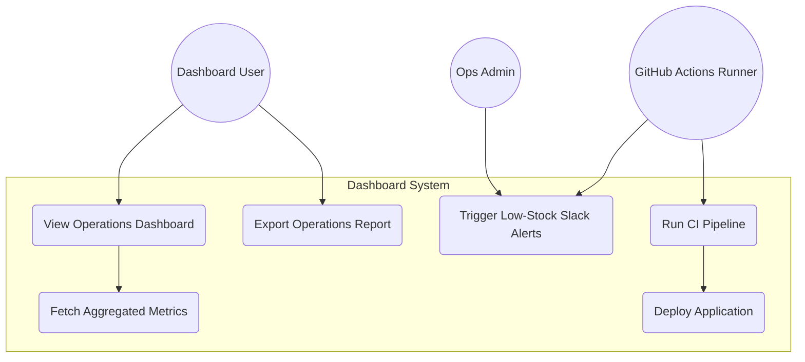
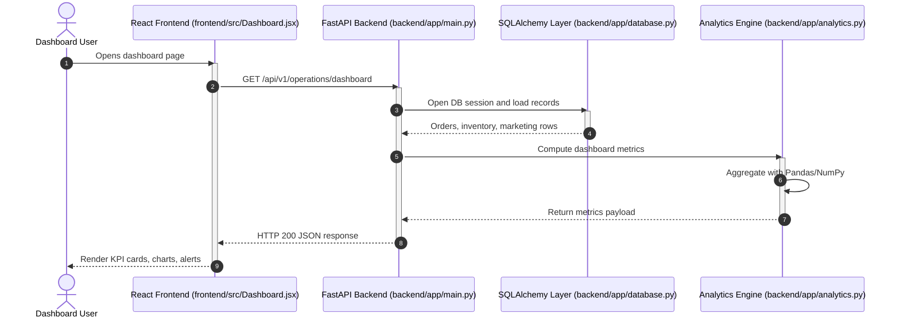
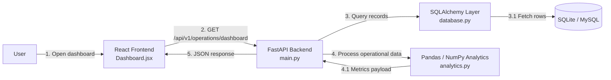
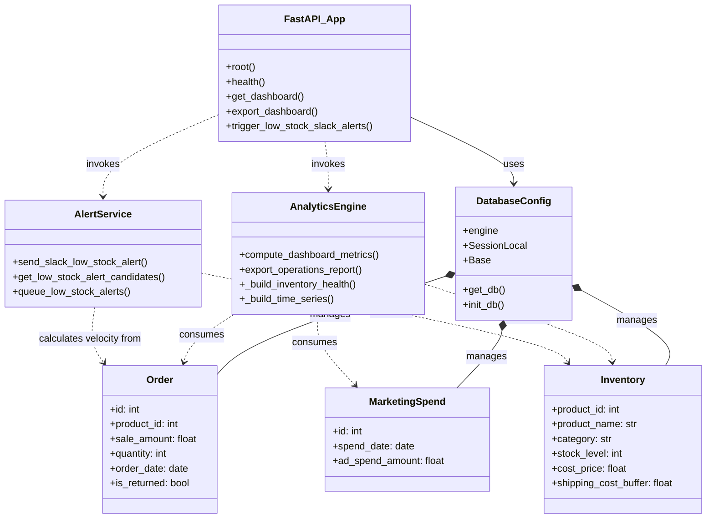
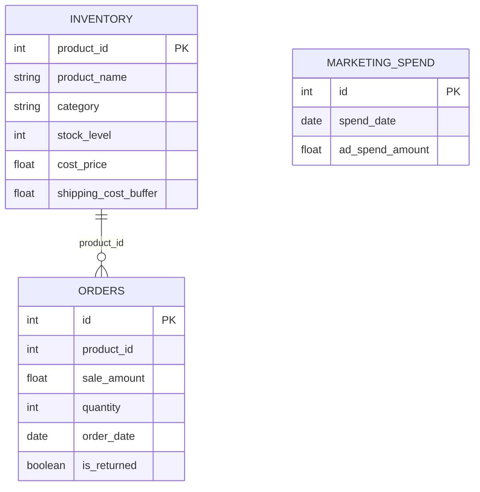
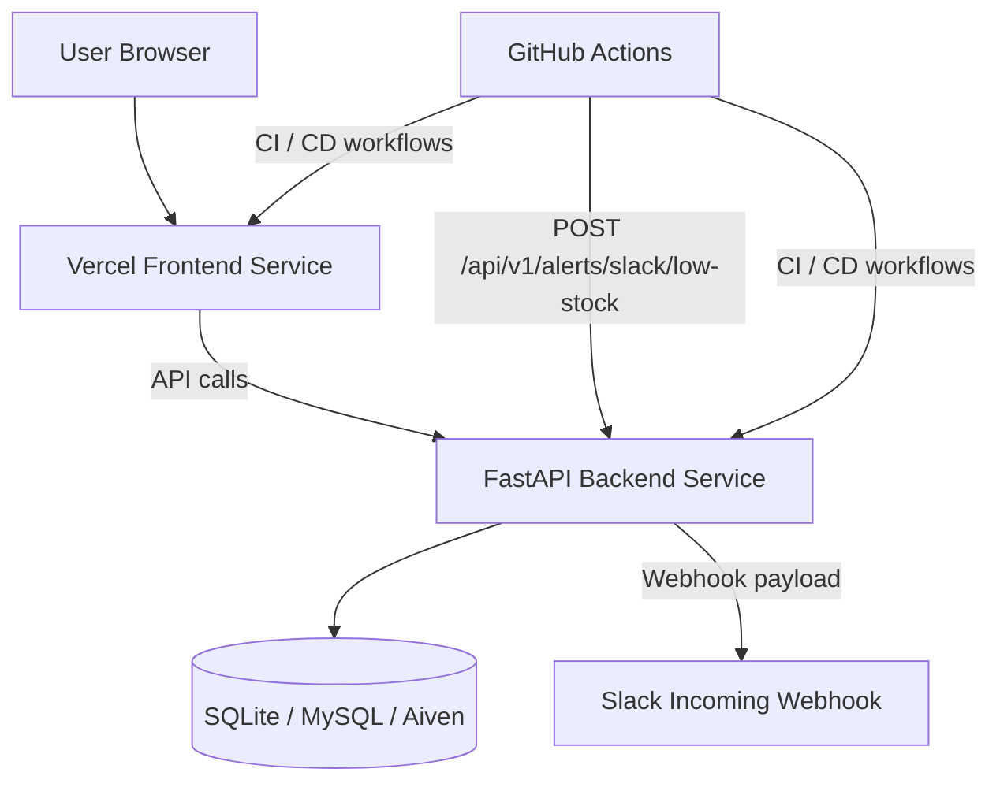
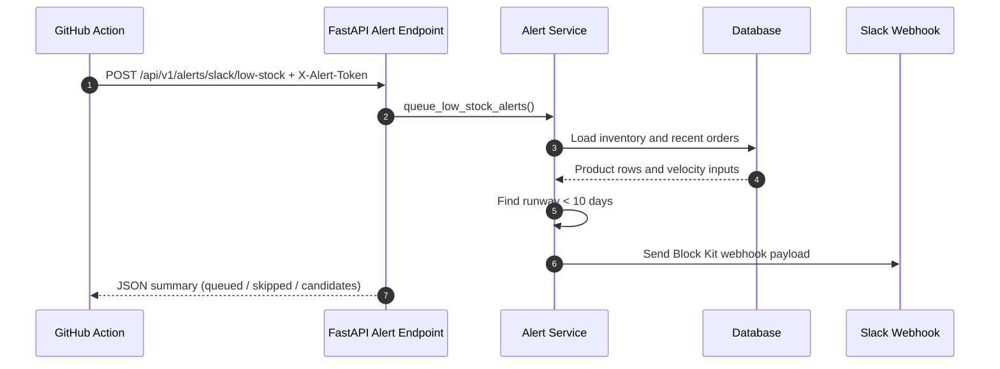
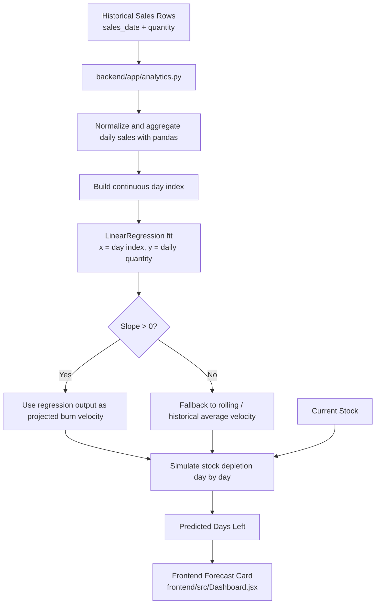

# E-commerce Business Operations & Analytics Dashboard

A full-stack analytics platform for monitoring e-commerce operations, built with a **FastAPI** backend and a **React + Vite** frontend.

---

## Project Updates

Recent updates added predictive inventory forecasting and stronger operational tooling:

- **Linear regression forecasting**
  - Added a `scikit-learn` `LinearRegression` workflow in [backend/app/analytics.py](/Users/macbookairm1/Documents/GitHub/LuminousLikelyVerification/backend/app/analytics.py).
  - Forecasting now computes the daily sales velocity slope from historical dated sales rows and predicts how many days remain before stock reaches zero.
  - Handles flat or negative demand slopes by falling back to rolling and historical average daily velocity.

- **Forecast-ready frontend card**
  - Reworked [frontend/src/Dashboard.jsx](/Users/macbookairm1/Documents/GitHub/LuminousLikelyVerification/frontend/src/Dashboard.jsx) into a premium dark-theme predictive forecasting card.
  - Displays current stock, daily burn velocity, slope trend, and exact depletion-day prediction.
  - Uses a mock API endpoint shape with local fallback behavior for frontend development.

- **Slack low-stock alert entrypoint**
  - Added a protected FastAPI alert trigger endpoint for low-stock Slack notifications.
  - Added a GitHub Actions scheduled workflow to invoke the alert endpoint automatically.

- **Containerized deployment fixes**
  - Aligned the frontend container proxy path with the backend route structure.
  - Fixed local MySQL bootstrap and grant behavior in Docker Compose-based deployment.

---

## Linear Regression Forecasting

The project now includes a real predictive inventory forecasting flow. This is used to estimate how quickly a product will run out of stock based on historical daily sales rather than only showing static inventory levels.

### Where Forecasting Is Used

Forecasting is used in two places:

1. **Backend calculation layer**
   - Implemented in [backend/app/analytics.py](/Users/macbookairm1/Documents/GitHub/LuminousLikelyVerification/backend/app/analytics.py)
   - Main functions:
     - `forecast_inventory_depletion(sales_rows, current_stock)`
     - `build_inventory_forecast(db, product_id=None)`

2. **Frontend forecasting card**
   - Rendered in [frontend/src/Dashboard.jsx](/Users/macbookairm1/Documents/GitHub/LuminousLikelyVerification/frontend/src/Dashboard.jsx)
   - Fetches live data from:
     - `GET /api/v1/forecast/inventory`

The frontend card shows:
- current stock
- projected daily burn velocity
- regression slope
- exact predicted days left until depletion

### What Data The Forecast Uses

The forecast uses historical order rows from the `orders` table and current stock from the `inventory` table.

Expected historical input shape:

```python
[
    {"sales_date": "2026-05-01", "quantity": 14},
    {"sales_date": "2026-05-02", "quantity": 12},
    {"sales_date": "2026-05-03", "quantity": 17},
]
```

The code also accepts equivalent aliases such as:
- `order_date` or `date`
- `units_sold` or `qty`

### How The Forecast Is Calculated

The forecasting calculation works in these stages:

1. **Normalize raw history**
   - Convert incoming sales rows into a Pandas DataFrame
   - Parse dates
   - Convert quantities to numeric values
   - Group by day so each day has one sales quantity total

2. **Fill missing dates**
   - Build a continuous daily date range from the first sale date to the last
   - Reindex the DataFrame so missing days become `0`

3. **Fit linear regression**
   - Create an integer day index:

   ```text
   day 0, day 1, day 2, day 3, ...
   ```

   - Use:
     - `x = day index`
     - `y = daily_quantity`

   - Fit scikit-learn:

   ```python
   regression = LinearRegression()
   regression.fit(x_axis, velocity_series)
   ```

4. **Extract the slope**
   - `regression.coef_[0]` is treated as the daily sales velocity slope
   - Positive slope means demand is increasing over time
   - Flat or negative slope means trend-based acceleration is not trusted for depletion simulation

5. **Choose the burn velocity**
   - If the regression trend is usable:
     - use the regression output as the projected burn velocity
     - use the slope to increase future daily demand during the depletion simulation
   - Otherwise:
     - fall back to average observed sales velocity

6. **Simulate stock depletion**
   - Starting from `current_stock`, subtract projected daily burn velocity each day
   - If a positive slope exists, increase the burn rate gradually over time
   - Stop when stock reaches zero
   - Return the exact number of days remaining

### Fallback Logic

The forecasting code deliberately avoids over-trusting regression when the trend is weak or misleading.

Fallback behavior:

- **No stock**
  - forecast returns `0` days left
  - strategy: `no_stock_remaining`

- **No history**
  - forecast returns `0` days left
  - strategy: `no_history_available`

- **Flat or negative slope**
  - regression slope is ignored
  - the model falls back to rolling and historical average daily velocity
  - strategy: `fallback_average`

- **Positive slope**
  - regression is used directly
  - strategy: `linear_regression`

### Formula Interpretation

This implementation does not use a single closed-form equation for final depletion because it simulates daily inventory burn. Conceptually, it combines:

```text
Predicted Daily Burn = Regression Output or Fallback Average
Days Left ≈ Current Stock / Effective Daily Burn
```

When a positive slope exists, the daily burn is increased over time during simulation, so depletion can happen faster than a simple static division would suggest.

### Output Payload

The backend returns a forecasting payload like this:

```json
{
  "product_id": 101,
  "product_name": "AeroNoise Headphones",
  "category": "Electronics",
  "current_stock": 142,
  "daily_burn_velocity": 18.4,
  "daily_sales_velocity_slope": 0.72,
  "historical_average_velocity": 15.9,
  "predicted_days_left": 7.7,
  "forecast_strategy": "linear_regression",
  "alert_level": "critical"
}
```

### Why This Design Was Chosen

This forecasting design is pragmatic for an operations dashboard:

- simple enough to explain
- fast enough to run inline in a request
- better than static average-only runway estimates
- safer than blindly trusting regression in declining or noisy demand cases

It gives operators a more actionable depletion estimate while keeping the implementation maintainable.

---

## Detailed Features

- **Operations KPI dashboard**
  - Surfaces gross revenue, net profit, ad spend efficiency, warning count, and LTV/CAC health in a single view.
  - Uses a compact management-style layout intended for repeated operational review rather than a marketing presentation.

- **Date range filtering**
  - Filters analytics by `start_date` and `end_date`.
  - Recomputes dashboard metrics and exports against the selected reporting window.

- **Revenue and profitability trend analysis**
  - Displays time-series performance with a mode switch between gross sales and net profit.
  - Aggregates operational data into chart-friendly weekly trend output for the frontend.

- **Inventory risk detection**
  - Calculates sales velocity and estimated days of inventory left.
  - Flags products with critical reorder risk and surfaces them in a low-stock table.

- **Predictive inventory depletion forecasting**
  - Uses `pandas` and `scikit-learn` linear regression to estimate burn-rate acceleration over time.
  - Predicts exact depletion timing from dated historical sales rows and current stock levels.
  - Falls back to average-velocity forecasting when trend data is flat, declining, or incomplete.

- **Category return-rate analysis**
  - Breaks down return performance by product category.
  - Highlights categories exceeding a return-rate threshold so operational issues are visible quickly.

- **Exportable operational reports**
  - Supports report export from the API in `csv` and `xlsx` formats.
  - Combines order, inventory, marketing, KPI, and alert-oriented data into a downloadable operations summary.

- **Managed MySQL and local SQLite support**
  - Runs against MySQL for deployed environments.
  - Falls back to local SQLite for simple local development and demo usage.
  - Supports managed MySQL options such as connection timeouts, TLS, and credential-based `DATABASE_URL` configuration.

- **Automatic demo data seeding**
  - Creates schema objects on startup and seeds sample operational data when the database is empty.
  - Provides a ready-to-demo dataset covering orders, inventory, and marketing spend.

- **Frontend resilience for API routing issues**
  - Uses a production-safe backend route fallback for Vercel service routing.
  - Detects non-JSON API responses and shows clearer runtime errors instead of crashing on HTML payloads.

- **Protected Slack alert automation**
  - Supports a dedicated low-stock Slack alert trigger endpoint protected by a shared secret token.
  - Includes scheduled GitHub Actions automation for recurring low-stock checks.

- **Containerized local stack**
  - Includes Dockerfiles for backend and frontend plus Compose-based local orchestration.
  - Supports a local MySQL service seeded from `database/init.sql`.

- **CI/CD workflow**
  - Validates backend imports and compilation.
  - Runs frontend lint and production build.
  - Verifies Docker Compose configuration and image builds.
  - Supports optional SSH-based deployment when secrets are configured.

---

## Architecture Overview

```
workspace/
├── backend/
│   ├── app/
│   │   ├── main.py          # FastAPI app — routes & CORS
│   │   ├── database.py      # SQLAlchemy models + SQLite/MySQL config
│   │   └── analytics.py     # Pandas/NumPy analytics + LinearRegression forecasting
│   └── requirements.txt
├── frontend/
│   ├── src/
│   │   ├── main.jsx         # React entry point
│   │   ├── App.jsx          # Root component
│   │   ├── Dashboard.jsx    # Main dashboard UI
│   │   └── index.css        # Global dark theme styles
│   ├── index.html
│   ├── package.json
│   └── vite.config.js
├── .github/
│   └── workflows/
│       └── ci-cd.yml        # CI/CD pipeline
└── README.md
```

---

## How Data Flows Through This Project

When a user opens the dashboard, the request path moves through the project in this order:

```text
[Browser / frontend/src/Dashboard.jsx]
        |
        v  (HTTP request to FastAPI)
[backend/app/main.py] (API route handler)
        |
        v  (loads operational records)
[backend/app/database.py] <----> [SQLite / MySQL Database]
        |
        v  (computes metrics, summaries, and exports)
[backend/app/analytics.py] (Pandas / NumPy)
        |
        v  (JSON response / export file response)
[Returned to the React dashboard UI]
```

In practice:

1. The React dashboard in [frontend/src/Dashboard.jsx](/Users/macbookairm1/Documents/GitHub/LuminousLikelyVerification/frontend/src/Dashboard.jsx) requests operational data from the backend API.
2. FastAPI routes in [backend/app/main.py](/Users/macbookairm1/Documents/GitHub/LuminousLikelyVerification/backend/app/main.py) receive the request and open a database session.
3. Database configuration and SQLAlchemy models in [backend/app/database.py](/Users/macbookairm1/Documents/GitHub/LuminousLikelyVerification/backend/app/database.py) connect to SQLite locally or MySQL in deployed environments.
4. The analytics layer in [backend/app/analytics.py](/Users/macbookairm1/Documents/GitHub/LuminousLikelyVerification/backend/app/analytics.py) transforms raw orders, inventory, and marketing data into dashboard metrics, inventory risk signals, and exportable reports.
5. The backend returns structured JSON or a downloadable file, and the frontend renders the result into the dashboard interface.

---

## Architecture Diagrams

These diagrams are written in Mermaid so the project structure, runtime flow, and integrations are easier to inspect.

### Use Case Diagram



### Sequence Diagram



### Communication Diagram



### Class Diagram



### ERD Diagram



### Deployment / Integration Diagram



### Alert Trigger Flow



### Forecasting Design Diagram



This forecasting design uses `scikit-learn` linear regression to estimate whether demand is accelerating over time. If the slope is flat or negative, the model falls back to average observed daily burn to avoid unstable depletion estimates.

---

## Running Inside Replit

Two workflows are configured — they start automatically when you open the project.

| Workflow | Command | Port |
|---|---|---|
| **Backend** | `cd backend && pip install -r requirements.txt && python app/main.py` | 8000 |
| **Frontend** | `cd frontend && npm install && npm run dev` | 5173 |

The Vite dev server proxies `/api` requests to the FastAPI backend, so both services communicate seamlessly inside the preview.

---

## Environment Variables (Optional)

See [`.env.example`](/Users/macbookairm1/Documents/GitHub/LuminousLikelyVerification/.env.example) for a complete template you can use for Vercel or local development.

To connect to an **AWS RDS MySQL** instance instead of the local SQLite fallback, set:

| Variable | Description |
|---|---|
| `DB_USER` | MySQL username |
| `DB_PASSWORD` | MySQL password |
| `DB_HOST` | RDS endpoint hostname |
| `DB_NAME` | Database name |

If any of these are absent, the app automatically uses a local `ecommerce.db` SQLite file and seeds it with 240 demo orders.

For managed MySQL providers such as Aiven, you can also set:

| Variable | Description |
|---|---|
| `DB_CONNECT_TIMEOUT` | Connection timeout in seconds |
| `DB_READ_TIMEOUT` | Read timeout in seconds |
| `DB_WRITE_TIMEOUT` | Write timeout in seconds |
| `DB_SSL_MODE` | Set to `require` to enable TLS |
| `DB_SSL_CA` | Optional CA certificate path when your platform provides one |
| `SLACK_WEBHOOK_URL` | Incoming webhook URL for low-stock Slack alerts |
| `SLACK_ALERT_TOKEN` | Shared secret required by the Slack alert trigger endpoint |

---

## API Endpoints

| Method | Path | Description |
|---|---|---|
| `GET` | `/` | Health root |
| `GET` | `/health` | Health check |
| `GET` | `/api/v1/operations/dashboard` | Full metrics payload |
| `GET` | `/api/v1/operations/export` | Export operations report as `csv` or `xlsx` |

---

## Analytics Engine

- **Data processing** — Uses Pandas and NumPy to transform order, inventory, and marketing datasets into operational metrics.
- **Profitability modeling** — Computes recognized revenue, gross margin, ad-spend impact, and net profit from transactional data.
- **Inventory forecasting** — Estimates sales velocity and days of inventory left for replenishment risk detection.
- **Retention efficiency tracking** — Calculates LTV/CAC ratio and marks poor acquisition efficiency as a warning condition.
- **Time-series aggregation** — Produces labeled weekly trend data for gross sales and net profit charts.

---

## Frontend Dashboard

- **Top KPI cards** — Revenue, profit, warning, and acquisition-efficiency indicators.
- **Trend visualization** — Interactive line chart powered by `react-chartjs-2`.
- **Return-rate analysis** — Horizontal category comparison for return performance.
- **Operational tables** — Low-stock product visibility with velocity and days-left context.
- **Export workflow** — Direct CSV export from the dashboard UI.
- **API-aware error handling** — Better messaging when the frontend receives HTML or invalid API responses.

---

## CI/CD Pipeline

`.github/workflows/ci-cd.yml` provides:

1. **Backend CI** — installs Python dependencies, compiles the FastAPI app, and runs a backend import smoke test
2. **Frontend CI** — installs Node dependencies, runs ESLint, and builds the Vite app
3. **Docker CI** — validates `docker-compose.yml` and builds the backend and frontend images
4. **Deploy** — runs only for pushes to `main` or manual dispatch after all CI jobs pass and the deploy secrets are configured
5. **Slack Low-Stock Alerts** — scheduled GitHub Action calls the protected Slack alert endpoint once per day or on manual dispatch

### Required GitHub Secrets

If these repository secrets are not configured, the deploy job is skipped:

- `HOST`
- `USER`
- `SSH_PRIVATE_KEY`

### Required GitHub Secrets For Scheduled Slack Alerts

The scheduled workflow in [slack-alert.yml](/Users/macbookairm1/Documents/GitHub/LuminousLikelyVerification/.github/workflows/slack-alert.yml) requires:

- `ALERT_ENDPOINT_URL`
- `SLACK_ALERT_TOKEN`

Example `ALERT_ENDPOINT_URL` values:

- `https://your-backend.example.com/api/v1/alerts/slack/low-stock`
- `https://your-project.vercel.app/_/backend/api/v1/alerts/slack/low-stock`
